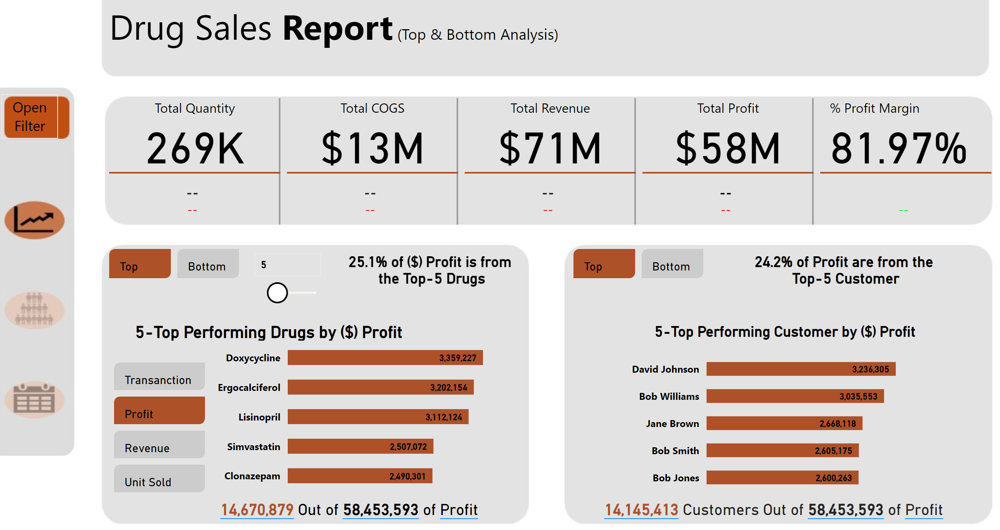
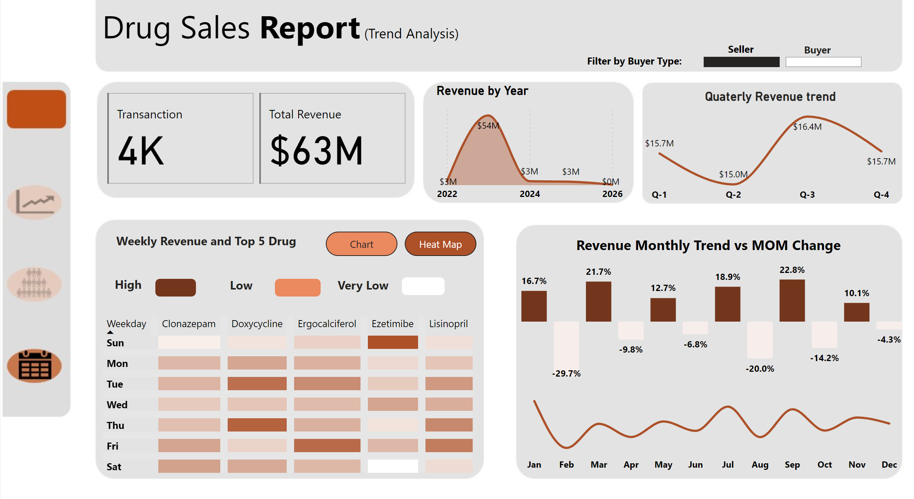
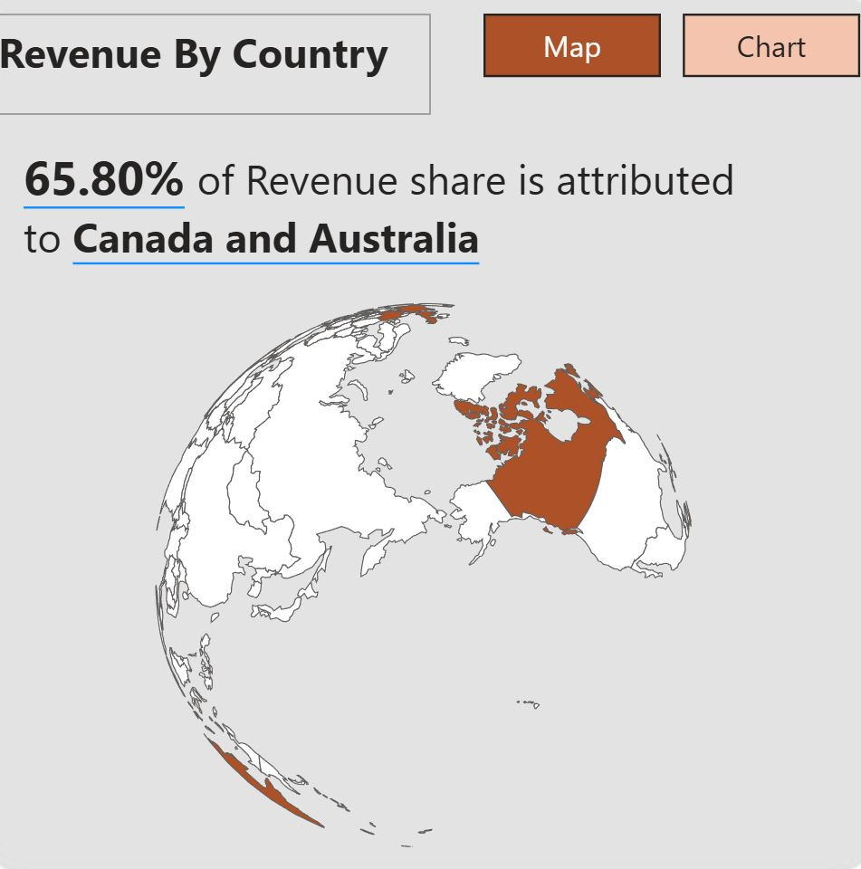
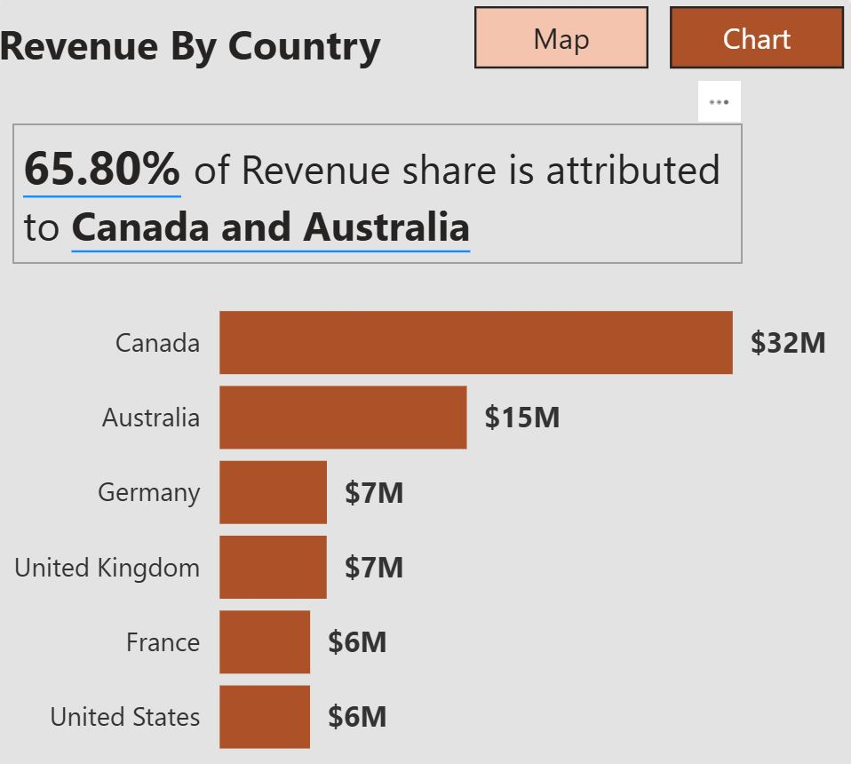
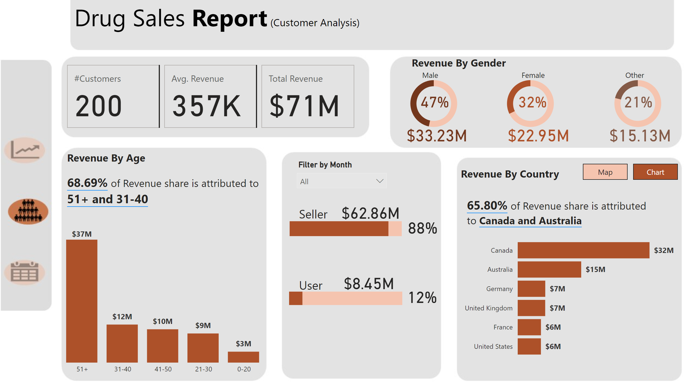
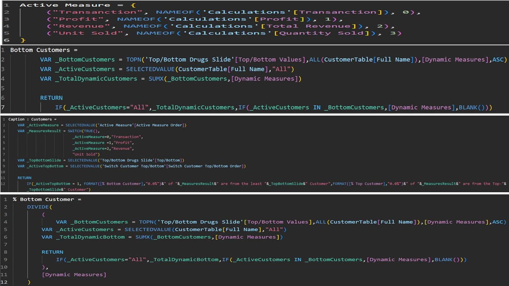

# Drug_Sales_Report
This personal project explores global patterns in drug consumption using Power BI. It’s designed to uncover trends, disparities, and usage distribution across countries and drug categories using dynamic visuals and interactivity. The goal is to support data storytelling around public health insights 

# Drug Consumption Insights Dashboard (Power BI)

This personal project explores global patterns in drug consumption using Power BI. It’s designed to uncover trends, disparities, and usage distribution across countries and drug categories using dynamic visuals and interactivity. The goal is to support data storytelling around public health insights and demonstrate advanced Power BI development from raw data to executive-ready dashboard.

---

## 🌐 Live Report

👉 [**Click here to view the interactive dashboard on Power BI Online**](https://app.powerbi.com/groups/me/reports/b70e0ef0-533f-4670-bc86-0e2b2a034889/ReportSectione330299b3c0a47ed2e28?experience=power-bi)

*login is required. Works best on desktop.*

or

for a quick overview of the dashboard on youtube, click [**here**](https://youtu.be/9hee1ocrjig) 

---

## 🔍 Project Objective

Build a comprehensive data visualization dashboard that:
- Allows country-by-country comparison of drug consumption.
- Shows time-based and category-level trends.
- Demonstrates dashboard design, interactivity, and logic handling with DAX.

---

## 📊 Dashboard Features

- **Geographic Analysis**: Heatmaps and bar charts comparing drug usage by country.
- **Time Trends**: Line graphs showing year-over-year consumption shifts.
- **Drug Category Breakdown**: Visuals segmented by type of drug consumed.
- **Interactivity**: Slicers and tooltips for year, category, and country selection.
- **Executive Metrics**: Custom KPIs, summary cards, and ranked insights.

---

## ⚙️ Tools & Techniques Used

- Power BI Desktop
- Power Query Editor for ETL
- Data Modeling (fact/dimension relationships)
- DAX for calculated measures
- Bookmarking and visual grouping
- Report formatting and UX best practices

---
## 📸 Dashboard Previews

### 🌍 Dashboard Overview

### 📉 Yearly Trend Analysis

### 🌐 Country Drilldown

   By Map                                   |            By Chart                   
:-------------------------------------:     | :------------------------------------:
            |   

### 🧪 Drug Category Breakdown

---

## 🔧 Advanced DAX Logic (Sample)

This dashboard contains dynamic logic that responds to user interaction and filters.

📌 **DAX Highlights**:
- Dynamic switching between metrics like Profit, Revenue, Unit Sold, etc.
- Conditional captions using SWITCH and formatting functions.
- Custom KPIs using `TOPN`, `SUMX`, and context-aware calculations.

➡️ View more DAX logic in the [`dax-measures.md`](dax/dax_measures.tex) file.

---

## 🧠 Key Learnings

- How to structure data for high-performance visuals
- Building dynamic DAX for custom logic and interactivity
- Improving dashboard storytelling and user flow
- Publishing and sharing dashboards via Power BI Online

---

## 📁 Files in this Repository

| File | Description |
|------|-------------|
| `DrugDashboard.pbix` | Main Power BI dashboard file |
| `/screenshots/` | Contains all images used in this README |
| `/dax/dax-measures.md` | Optional detailed DAX code & logic |

---

## 👤 Author

**Peter Junior Nwachineke**  
Data Analyst | MBA in International Business Management  
📫 [peter.j.nwachineke@gmail.com](mailto:peter.j.nwachineke@gmail.com)  
🔗 [LinkedIn](https://www.linkedin.com/in/peter-j-nwachineke-819291247/) • [Portfolio](https://github.com/PeterAnalyst)
